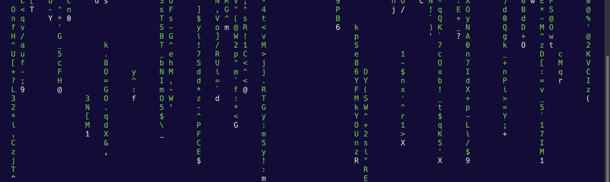

# Matrix Synapse — Self-Hosted Messenger Infrastructure



> **Unabhängiger verschlüsselter Messenger für alle, die eigene Infrastruktur betreiben.** Keine Limitierungen, keine dritten Parteien, keine offenen Ports. Eine Domain reicht.

Für Self-Hoster mit AI-Agenten (OpenClaw, Hermes, mautrix-basierte Bots) auf eigener Hardware: Synapse läuft auf deinem Server, Bots verbinden sich über das interne Netz, Mobile Clients über Cloudflare Tunnel. Volle Ende-zu-Ende-Verschlüsselung. Keine Cloud-Metadata.

## Architecture

```
                        User Phone ───┐
                                       │
                        User Phone ───┼──► Cloudflare Tunnel ──► Synapse (:8008)
                                       │    (TLS, no open ports)    │
                                       │                            │
                                       │     ┌──────────────────────┘
                                       │     │ (internal, no CF)
                                       │     │
    Your Server (KVM host)             │     │
    ┌──────────────────────┐           │     │
    │  AI Agent (OpenClaw) ┼───────────┼─────┘   localhost:8008
    │  Synapse + Postgres  │           │
    │  Cloudflared         │           │
    └──────────┬───────────┘           │
               │ libvirt bridge        │
               │ <internal-ip>:8008     │
               │                       │
    ┌──────────┴───────────┐           │
    │  Guest VM (KVM)      │           │
    │  AI Agent (Hermes) ───┼───────────┘   <internal-ip>:8008
    │  (Hermes Gateway)     │
    └──────────────────────┘
```

**Was Cloudflare sieht:** Handys mit unregelmäßigem Mobile-Traffic.

**Was Cloudflare nicht sieht:** Bots mit 24/7 `/sync`-Polling, deren Access-Tokens, Raum-Mitgliedschaften oder Bot-Existenz. Bot-Tokens verlassen nie den Host.


## Features

- **Synapse + PostgreSQL** in Docker (localhost + internal interfaces only)
- **Cloudflare Tunnel** — keine offenen Router-Ports, keine exponierte IP
- **E2E Encryption** — Olm/Megolm
- **Bot-First Architecture** — Bots verbinden sich intern, niemals über CF
- **Manual Registration** — keine offenen Signups
- **Automated Backups** — täglich, GPG-verschlüsselt (AES256), 7 Tage Retention
- **Federation Disabled** — Single-Server-Setup, keine externen Key-Server

## Quick Start

```bash
# 1. Clone
git clone git@github.com:<USER>/matrix-synapse.git
cd matrix-synapse

# 2. Create .env
cat > .env << 'EOF'
POSTGRES_PASSWORD=<generate-a-strong-password>
SYNAPSE_SERVER_NAME=<your-domain>
EOF

# 3. Generate initial Synapse config
docker compose up -d postgres
docker compose run --rm synapse generate

# 4. Edit synapse-data/homeserver.yaml (see DEPLOYMENT.md §2.5)

# 5. Start
docker compose up -d

# 6. Verify
curl -s http://localhost:8008/health
# → OK
```

## Management

| Action | Command |
|--------|---------|
| Start | `docker compose up -d` |
| Stop | `docker compose down` |
| Status | `docker compose ps` |
| Logs | `docker logs -f synapse` |
| Backup | `./backup.sh` |
| Update | `docker compose pull && docker compose up -d` |
| Tunnel | `sudo systemctl status cloudflared` |
| Create User | `echo "no" \| docker exec -i synapse register_new_matrix_user -u NAME -p "PW" -c /data/homeserver.yaml http://localhost:8008` |
| API Check | `curl -s https://matrix.<DOMAIN>/_matrix/client/versions` |

## Security

- ✅ Registration: OFF (manual CLI only)
- ✅ Federation: OFF (`federation_domain_whitelist: []`)
- ✅ E2E Encryption: Olm/Megolm
- ✅ No open router ports — Cloudflare Tunnel only
- ✅ Synapse listens on `127.0.0.1:8008` + internal interfaces only
- ✅ Bot tokens never traverse Cloudflare
- ✅ Rate limiting configured
- ✅ Daily backups with 7-day retention (GPG AES256)
- ✅ `.env`, `homeserver.yaml`, signing keys all gitignored

## Files

```
├── .env                       # POSTGRES_PASSWORD + domain (gitignored!)
├── docker-compose.yml         # Service definitions
├── docker-compose.override.yml # Internal interface bindings (gitignored!)
├── backup.sh                  # Daily backup script
├── README.md                  # This file
├── DEPLOYMENT.md              # Full step-by-step playbook
├── docs/
│   └── bot-connection.md      # How to connect bots internally (3 topologies)
├── assets/                    # Banner + architecture diagram
├── backups/                   # Backup archive (gitignored)
└── synapse-data/              # Synapse config + media (gitignored)
    ├── homeserver.yaml        # Main config (gitignored!)
    ├── *.signing.key          # Server keys (gitignored!)
    └── media_store/           # Uploads
```

## Documentation

- **[DEPLOYMENT.md](./DEPLOYMENT.md)** — Full step-by-step playbook (Cloudflare Tunnel, Synapse config, user creation, `.well-known`, Element client setup, migration, pitfalls)
- **[docs/bot-connection.md](./docs/bot-connection.md)** — Connect bot gateways (OpenClaw, Hermes, mautrix) to Synapse **without routing tokens through Cloudflare** (3 topologies + pitfalls)

## Who is this for?

Du betreibst eigene Infrastruktur (dedicated server, KVM host, Home-Lab) und willst:

- **Unabhängig sein** von Discord, Telegram, WhatsApp — kein Account-Bann kann dich abschalten
- **AI-Agenten** (OpenClaw, Hermes) über einen verschlüsselten Messenger kommunizieren lassen
- **Vollständige Kontrolle** über Daten, Metadaten und Zugriffs-Tokens haben
- **Keine Limitierungen** durch externe Plattformen — Rate-Limits, API-Änderungen, ToS
- **Nur eine Domain** brauchen — sonst nichts. Keine teuren SaaS-Abos, kein Cloud-Provider-Lock-in

Setup-Kosten: Eine Domain (~10€/Jahr) + ein Server den du schon hast. Cloudflare Tunnel ist kostenlos.

---

_Self-hosted with care. No tracking, no middlemen, no open ports._
