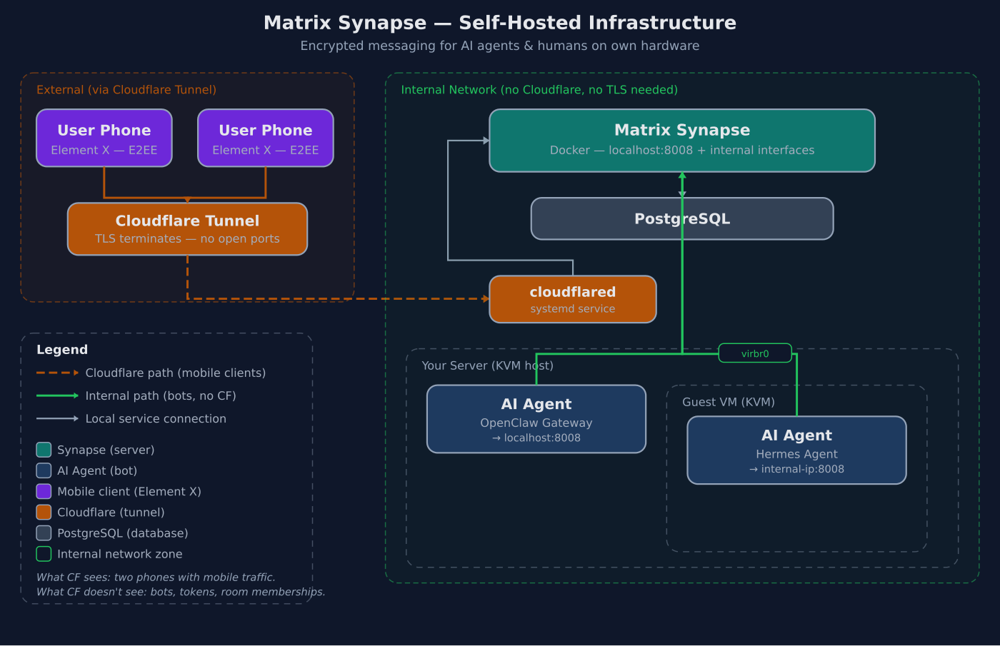

# Matrix Synapse — Self-Hosted Messenger Infrastructure


> **Independent encrypted messenger for anyone running their own infrastructure.** No limitations, no third parties, no open ports. Just a domain.

For self-hosters running AI agents (OpenClaw, Hermes, mautrix-based bots) on their own hardware: Synapse runs on your server, bots connect over the internal network, mobile clients come in through Cloudflare Tunnel. Full end-to-end encryption. No cloud metadata.

## Architecture



**What Cloudflare sees:** Phones with irregular mobile traffic.

**What Cloudflare doesn't see:** Bots with 24/7 `/sync`-polling, their access tokens, room memberships, or the mere existence of bots. Bot tokens never leave the host.

## Features

- **Synapse + PostgreSQL** in Docker (localhost + internal interfaces only)
- **Cloudflare Tunnel** — no open router ports, no exposed IP
- **E2E Encryption** — Olm/Megolm
- **Bot-First Architecture** — bots connect internally, never via Cloudflare
- **Manual Registration** — no open signups
- **Automated Backups** — daily, GPG-encrypted (AES256), 7-day retention
- **Federation Disabled** — single-server setup, no external key servers

## Quick Start

```bash
# 1. Clone
git clone git@github.com:<USER>/matrix-synapse.git
cd matrix-synapse

# 2. Create .env
cat > .env << 'EOF'
POSTGRES_PASSWORD=<generate-a-strong-password>
SYNAPSE_SERVER_NAME=<your-domain>
EOF

# 3. Generate initial Synapse config
docker compose up -d postgres
docker compose run --rm synapse generate

# 4. Edit synapse-data/homeserver.yaml (see DEPLOYMENT.md §2.5)

# 5. Start
docker compose up -d

# 6. Verify
curl -s http://localhost:8008/health
# → OK
```

## Management

| Action | Command |
|--------|---------|
| Start | `docker compose up -d` |
| Stop | `docker compose down` |
| Status | `docker compose ps` |
| Logs | `docker logs -f synapse` |
| Backup | `./backup.sh` |
| Update | `docker compose pull && docker compose up -d` |
| Tunnel | `sudo systemctl status cloudflared` |
| Create User | `echo "no" \| docker exec -i synapse register_new_matrix_user -u NAME -p "PW" -c /data/homeserver.yaml http://localhost:8008` |
| API Check | `curl -s https://matrix.<DOMAIN>/_matrix/client/versions` |

## Security

- ✅ Registration: OFF (manual CLI only)
- ✅ Federation: OFF (`federation_domain_whitelist: []`)
- ✅ E2E Encryption: Olm/Megolm
- ✅ No open router ports — Cloudflare Tunnel only
- ✅ Synapse listens on `127.0.0.1:8008` + internal interfaces only
- ✅ Bot tokens never traverse Cloudflare
- ✅ Rate limiting configured
- ✅ Daily backups with 7-day retention (GPG AES256)
- ✅ `.env`, `homeserver.yaml`, signing keys all gitignored

## Files

```
├── .env                       # POSTGRES_PASSWORD + domain (gitignored!)
├── docker-compose.yml         # Service definitions
├── docker-compose.override.yml # Internal interface bindings (gitignored!)
├── backup.sh                  # Daily backup script
├── README.md                  # This file
├── DEPLOYMENT.md              # Full step-by-step playbook
├── docs/
│   └── bot-connection.md      # How to connect bots internally (3 topologies)
├── assets/                    # Banner + architecture diagram
├── backups/                   # Backup archive (gitignored)
└── synapse-data/              # Synapse config + media (gitignored)
    ├── homeserver.yaml        # Main config (gitignored!)
    ├── *.signing.key          # Server keys (gitignored!)
    └── media_store/           # Uploads
```

## Documentation

- **[DEPLOYMENT.md](./DEPLOYMENT.md)** — Full step-by-step playbook (Cloudflare Tunnel, Synapse config, user creation, `.well-known`, Element client setup, migration, pitfalls)
- **[docs/bot-connection.md](./docs/bot-connection.md)** — Connect bot gateways (OpenClaw, Hermes, mautrix) to Synapse **without routing tokens through Cloudflare** (3 topologies + pitfalls)

## Who is this for?

You run your own infrastructure (dedicated server, KVM host, home lab) and want to:

- **Be independent** from Discord, Telegram, WhatsApp — no account ban can shut you down
- **Let AI agents** (OpenClaw, Hermes) communicate over an encrypted messenger
- **Have full control** over data, metadata, and access tokens
- **No limitations** from external platforms — rate limits, API changes, ToS
- **Only need a domain** — nothing else. No expensive SaaS subscriptions, no cloud provider lock-in

Setup cost: One domain (~$10/year) + a server you already have. Cloudflare Tunnel is free.

---

_Self-hosted with care. No tracking, no middlemen, no open ports._
